# Software Languages and their Users: Situation and Dynamics

[Github of Project....](https://github.com/ubiquarum66/UdacityReportsDSND)

In fictious year 2016, I imagined to be asked by fictious SW Universal IDE distributor IDEalIDE to evaluate the situation and perspective of 
todays SW developers. Is there a high affinity or volatility in usage of certain languages?
In this case a refactoring of their IDE shall be undertaken to target (which?) new languages.
    
## CRISP-DM Process: Pose and Answer Questions

1. Business Understanding
   + This problem is narrowed by answering the following questions
       + What is the most frequent used language nowadays?
       + Where would the community tend to, if free to do so?
       + Is there a difference between Professionals and others?
       + and how is Job Satisfaction linked to the mismatch of wish and situation?
2. Data Understanding
    + Data was analyzed regarding multiple choice answers and numerical values, see survey data in csv text file in GitHub
    + here the scene was shortly taken over by a c++ snippet and a sqlite database (can also be done using pandas selection) to find all possible categories for each column.
3. Prepare Data
    + Data mangling in this case was simple dropping of NAN values, as there is no sensible way to impute here.
    + Loss of data: 19000 sets down to 11000 sets. This is a remarkable loss, but there is no way to fill data sensibly. 
    + only three columns were used: 'HaveWorkedLanguage', 'WantWorkLanguage' and 'JobSatisfaction'
4. Data Modeling
    + Data modeling is only used as a transformation to an abstract 34-dim program-language-space to measure discrepancy between wish and set state
    + there is no prediction involved
5. Evaluate the Results
    + Evaluation of the results is done in the subsequent sections below...
6. Deploy
    + Data and tool can be found on GitHub, [Here](https://github.com/ubiquarum66/UdacityReportOne), results are deployed here on web blog...

## Questions 

### What is the most frequent used language nowadays?

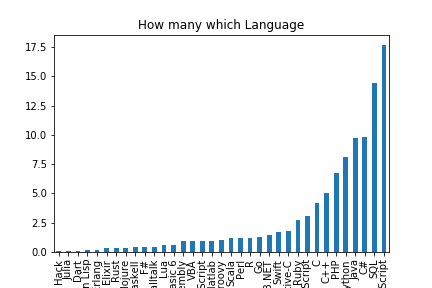
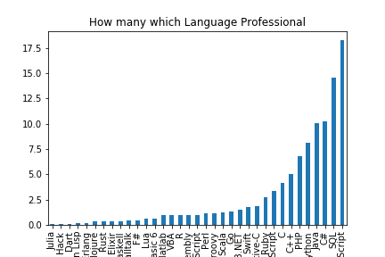

This Language Overview shows that the standard industry production languages for web application and desktop application (Java Script, C, C++, C#, Python, ...) still 
lead the group. Objective C might be due to Apple iOS. 

Votes of Professionals dominate the overall picture here by far, 30000 to 4000 votes.

### What is the most frequent desired language nowadays?

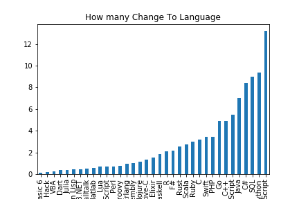
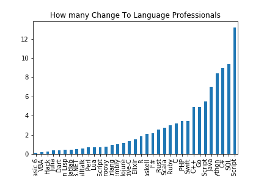

A very similar outcome to the first one, regarding production languages, but some volatility in the more exotic languages. Thus some deeper view:
  
#### Direct Comparision of Languages used and Languages nice to use, counts of all, only Professionals (ca 30000), and only Non Pros (ca 4000):

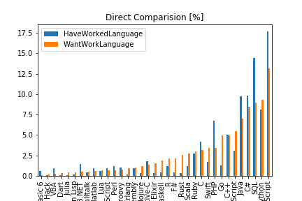
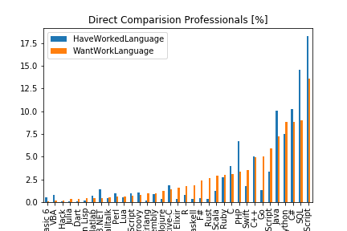
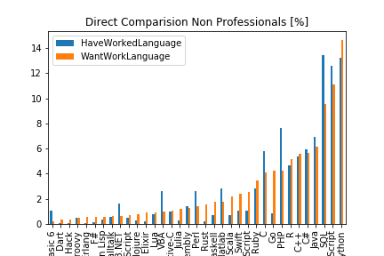

and, visually more concise: the differences  -- showing change potential... shown for only for Pro and only NonPro Respondents

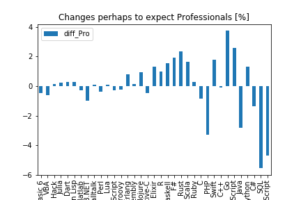

+ There is a loss of java-script, SQL, php and C#,  and
+ a small group of more exotic languages could get more popular
    + around Script, Go and Swift (web applications?)
    + around Haskell, R , F# and Scala.
    + This might be due to more AI/Statistics  applications  but would need deeper analysis.

Om the whole, in this picture there is no big discrepancy between wish to use and use of languages in the mean.

### Surprising fun fact:

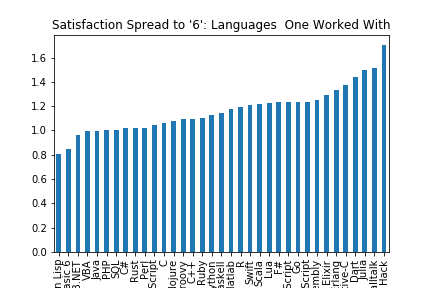

Job Satisfaction -- as a distance to '6' -- seems to be higher the more the languages differ from the mainstream of production code languages (small but beautiful).
On the other Hand, the number of statistical members of theses exotic languages goes down, thus, deviation might cover for more differences.

And --- just do not mingle correlation and causality without a theory or model! :-)

Just a fun fact!

### Linkage JobSatisfication and mismatch of wish and set situation?

A special metric was developed to measure the mismatch between a list of used and a list of 
desired programming languages. 

Without going into the detail: 

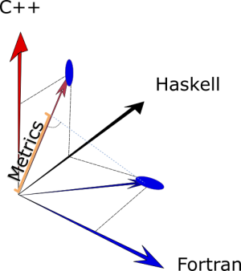

It is a dot product in a 20 dimensional space of programming languages, of  which unit length  vectors 
are spun by language lists.

+ This metric is 1 if and only if every used language appears in the wish list also, and the mapping is bijective.
+ This metric is 0 if and only if not one of the used languages appears in the wish list
+ This metric moves between the limits relative to the number of matches.

#### Results:

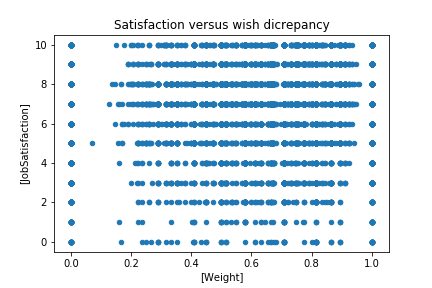
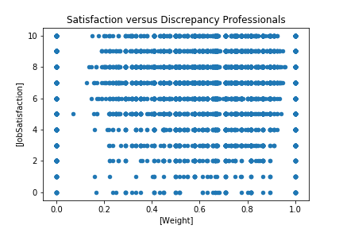

As can be seen, there is not even an correlation of language discrepancy to Job Satisfaction. Thus, the main influencing attributes seem to hide in the remaining 150 columns of the survey dataset.
This could mean, that volatility impetus just created by fitting the IDE better for the desired languages will be rather small.

### Conclusion

Regarding the distributions of used and  desired programming languages there is no urgent necessity to
move the IDEalIDE from standard production languages toward a hype new variant.

There is also no clear correlation between Job Satisfaction and distance metric between the usage and affinity scenarios.
Thus it might be assumed, that upcoming misfit of programming situation and target language will not create a strong impetus.

If optimizarions shall take place, they should go into improving support for Haskell, R, Scala etc., where there is some change potential.

### Thanks 

...to Stack Overflow for making their data available and to Udacity for the oportunity to handle it.
    