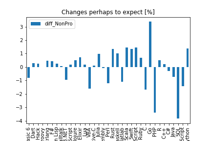

# My, oh my, Why are they Leaving?

A Tool to Investigate and try to predict users churning a music streaming service, Sparjify.

[Github of Project....](https://github.com/ubiquarum66/UdacityProjectSparkify)

This applidcation represents the final Project of Data Science Nanodegree Course. 

#### Conceptual Context 

The idea is to bundle and classify 
queries in case of one or multiple disaster, coming on different input channels as short text notes.

The resulting classification might help to direct officials or NGO helpers of different capabilit 
to scenes where they are really needed.

## CRISP-DM Process: Pose and Answer Questions

1. Business Understanding
    + see above, detect behavioural or other hints that enable decision makers to
    + offer incentives in time, or 
    + lower prices, improve delivery, if
    + indicators will show, that a user is immediately before churning the service.
    
    
2. Data Understanding
    + Data consists of log file of a (fictious?) web server, dealing out songs to users.
    + each entry in the log file describes an event, noting, on which page which button was pressed, which decision was made.
    + the data is not sorted by user id's or consecutive in timestamps, it just writes down the sequence of events.
    + Essential here is the detection of the action of churning, which might be assigned to the events on pages Submit Downgrade
    + The data of each user then splits into two patts, data before churning, and data after churning
    + Only the data before churning is relevant for the build up of the churning decision. This is the interesting part to be investigated.
        

2a) Structure of the dataset ( crude describe command):

        

2b) Check  for available NAN and Nulls (number gives count of NULL/NAN) data in specific column):

2c) Detailed set of Defiition of various Elements in EDA data set:
    + Number of User-Id-s (distinct) is 226
    + Suspicious User-ID is "", wth 8346 entries, they will be imputed by deleting.

+---------+------------------------------------------------------------------------------+
| Column  | Count or value-set                                                           | 
+=========+==============================================================================+
| Artist: | 17656                                                                        | 
+---------+------------------------------------------------------------------------------+
| Auth:   | ['Logged Out', 'Cancelled', 'Guest', 'Logged In']                            | 
+---------+------------------------------------------------------------------------------+
| Gender: | ['F', None, 'M']                                                             | 
+---------+------------------------------------------------------------------------------+
| Level:  | ['free', 'paid']                                                             | 
+---------+------------------------------------------------------------------------------+
| Page:   | ['Cancel', 'Submit Downgrade', 'Thumbs Down', 'Home', 'Downgrade',           | 
|         | 'Roll Advert', 'Logout', 'Save Settings', 'Cancellation Confirmation',       | 
|         | 'About', 'Submit Registration', 'Settings', 'Login', 'Register',             | 
|         | 'Add to Playlist', 'Add Friend', 'NextSong', 'Thumbs Up', 'Help',            | 
|         | 'Upgrade', 'Error', 'Submit Upgrade']                                        | 
+---------+------------------------------------------------------------------------------+
| Status: | [307, 404, 200]                                                              | 
+---------+------------------------------------------------------------------------------+

3. Prepare Data
    + Data mangling in this case means 
        + transform categorical gender data to numerical 0-1 data column
        + removal of unsufficient datasets, 
            + e.g. missing or suspicious user ID etc.
        + detection/feature extraction to distinguish before churn-asfter churn,
        + describing behavioural changes in the time before churn by numeric features.

+ My expectation here is, that the behaviour has to be anlyzed immediately before the churning
took place.  
+ It is further expected, but in no way already shown, that the number of consumed songs might fall
before churning takes place.
+ It is also expected that Gender might influence the decision and behaviour.

4. Data Modeling - 1 Deterministic
    + A rather stright forward Ansatz could be, that churning can already be predicted by a fall of number of consumed songs
      in the second half of the registration time in respect to the first half.
    + Thus the numer of songs in those two halfs have to be 'featured# and directly checked.
    
4. Data Modeling - 2 ML Algorithm
    + The mappin of a bunch of numerical features to a will churn/won't chirn decision is a classification problem.
    + Thus, a RandomForestClassifier will be used to try to predict churning on a test dataset, after being trained on a random train subset of above 70% of dada
    
5. Evaluate the Results
    + Evaluation ...
    
6. Deploy
    + Running either in the local Udacity spark workspace (Data Exploration and Mini Dataset) or in a notebook on the aws server of Amazon EMR environment.
    
## Questions 

The questions arising here a questions of imbalance , quality and relative reliability. So far there is no catalog and no further strategy from my side.

#### Structural Concept: 

ETL:

+ load_data(messages_filepath, categories_filepath) get the csv files as pandas Dataframes
+ clean_data(df) merge the two table by a join with common ID, check for duplicates, remove duplicates
+ spread the one string representation of 36 category tags into 36 binary columns.
+ save_data(df, database_filepath) put it allm into a sqlite3 database file in sql format 

ML:

+ load_data(database_filepath)  gets database sql --> Dataframe, creates test and train data
+ provide an tokenizer that will remove puntuation, split into tokens and lemmatize tokens (using re and nltk)
+ build_model() creates  pipeline of vectorizer and MultiOutputClassifier and RandomForestClassifier
+ model is trained.... and evaluation results to stdout....
+ model is saved !!! Due to slow computer optimizing took to long... use flask with non opt model ...!!!
+ optimize_model(model, X_train, Y_train) via GridSearch , two RndomForest parameters are spnned to find an optimuum. 
    + This was set as an extra call, as it took to long at my site.
+ and evaluation goes to stdout
+ opt. model is saved !!! Due to slow computer, I never reached this in test, sorry!

Spark:

#### Difficulties

For a user not acustomed to the working with AWS environment, The infra structure handling is quite difficult.

+ Get the spark server running at AWS
+ Get the results of spark evaluation to the local reporting desktop
+ But these are -- like everything in life -- just practicing topics.

#### Results:

Data Exploration:

Distribution of songs in the time before the churn events:

Distribution of songs over time of day:

Example Query:

### Conclusion

### Thanks 

...to Stack Overflow and figure eight for making their data available and to Udacity for the oportunity to handle it.
    