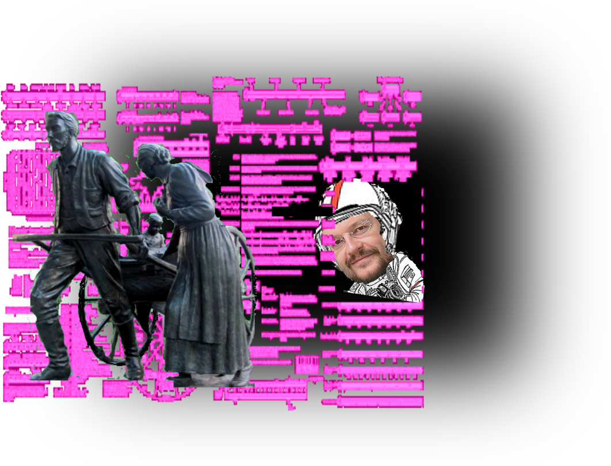

# My, oh my, Why are they Leaving?

A Tool to Investigate and try to predict users churning a (fictous) music streaming service, Sparkify.

[Github of Project....](https://github.com/ubiquarum66/UdacityProjectSparkify)

This application represents the final Project of Data Science Nanodegree Course. 

## Conceptual Context 

The idea is to bundle and classify 
log information out of the daily use of the streaming platform.

This accidentially created information shall help to identify users that are on the brink of churning, of leaving the revenue prone paid service.

The resulting classification might help to intercept this decision of churning just in time by offering incentives or cheaper service or or or...

Now the task is to inspect the logs, and find useful features 
+ to detect the churning itself, and to 
+ somehow describe user behaviour indirectly 
+ thus, by ML, detect behaviour leading to churn.

This is a classical classification problem.

## CRISP-DM Process: Pose and Answer Questions

1. Business Understanding
    + see above, detect behavioural or other hints that enable decision makers to
    + offer incentives in time, or 
    + lower prices, improve delivery, if
    + indicators will show, that a user is immediately before churning the service.
    
    
2. Data Understanding
    + Data consists of log file of a (fictious?) web server, dealing out songs to users.
    + each entry in the log file describes an event, noting, on which page which button was pressed, which decision was made.
    + the data is not sorted by user id's or consecutive in timestamps, it just writes down the sequence of events.
    + Essential here is the detection of the action of churning, which might be assigned to the events on pages Submit Downgrade
    + The data of each user then splits into two patts, data before churning, and data after churning
    + Only the data before churning is relevant for the build up of the churning decision. This is the interesting part to be investigated.
        

2a) Structure of the dataset ( crude describe command):

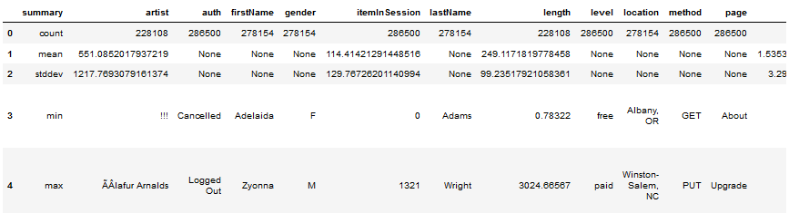
        
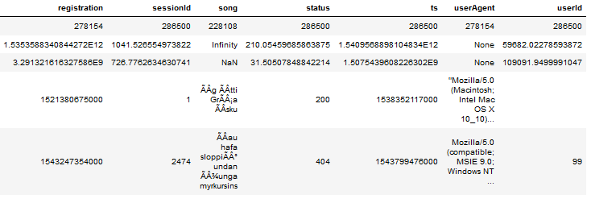

2b) Check  for available NAN and Nulls (number gives count of NULL/NAN) data in specific column):

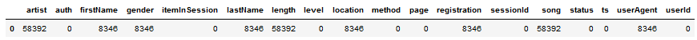

2c) Detailed set of Defiition of various Elements in EDA data set:
    + Number of User-Id-s (distinct) is 226
    + Suspicious User-ID is "", wth 8346 entries, they will be imputed by deleting.

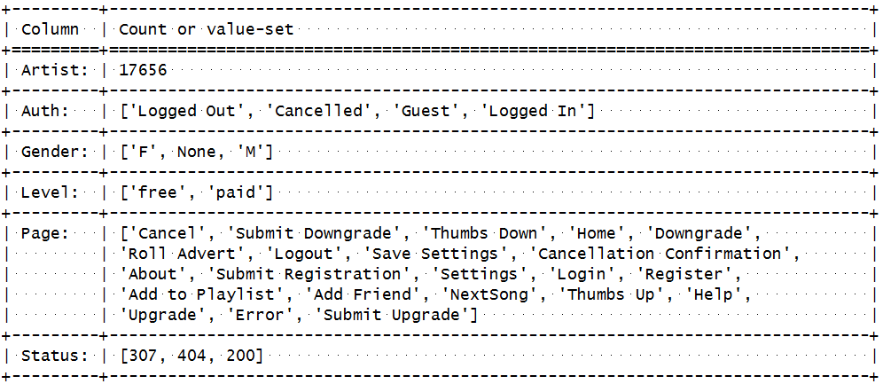

3. Prepare Data
    + Data mangling in this case means 
        + transform categorical gender data to numerical 0-1 data column
        + removal of unsufficient datasets, 
            + e.g. missing or suspicious user ID etc.
        + detection/feature extraction to distinguish before churn-asfter churn,
        + describing behavioural changes in the time before churn by numeric features.

+ My expectation here is, that the behaviour has to be anlyzed immediately before the churning
took place.  
+ It is further expected, but in no way already shown, that the number of consumed songs might fall
before churning takes place.
+ It is also expected that Gender might influence the decision and behaviour.

4. Data Modeling - 1 Deterministic
    + A rather stright forward Ansatz could be, that churning can already be predicted by a fall of number of consumed songs
      in the second half of the registration time in respect to the first half.
    + Thus the numer of songs in those two halfs have to be 'featured# and directly checked.
    + This interessting track could for the time being not followed up, but might be later....
    
    
4. Data Modeling - 2 ML Algorithm
    + The mapping of a bunch of numerical features to a "will churn/won't churn decision" is a classification problem.
    + Thus, first a RandomForestClassifier will be used to try to predict churning on a test dataset, 
      after being trained on a random train subset of above 70% of data.

The candidate features for the fit are evaluated as follows:

4.1 Categorical Data: 

The categorical Data that shall have some influence, has been identified to be

+ Level (paid or free, if free no downgrade needed), 
+ Gender, empirical, see picture, bars are different.
+ (month and date is unclear but nevertheless used, as the mini dataset just covers two to three month)

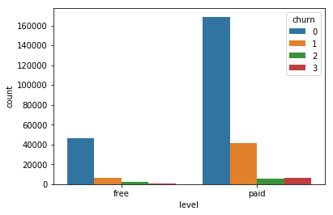
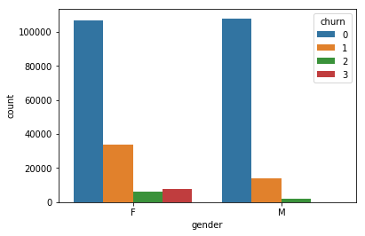
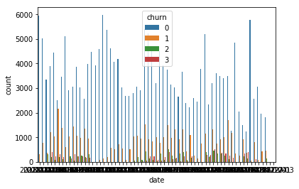
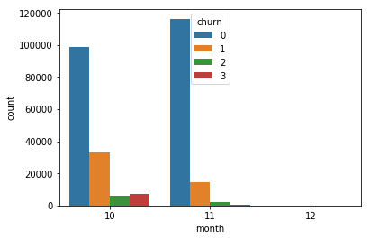

4.2 Numerical Data

+ beside the frequencies of usage, here the time based features play a small role, 
+ not first and last, but difference (endurance).

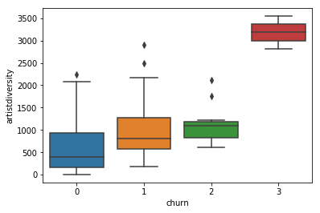
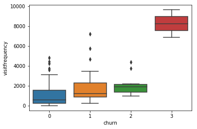
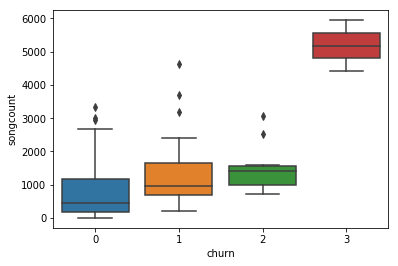
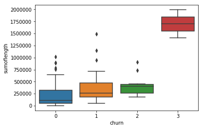
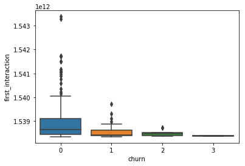
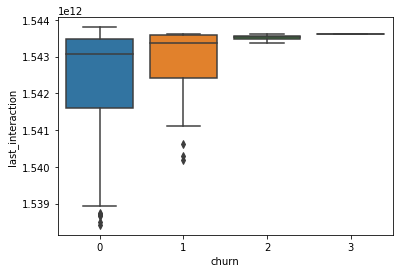

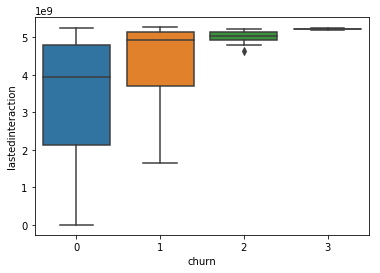
    
    
    
5. Evaluate the Results

    + ... the RandomForestClasifier opted the prediction f1 metric to be 0.73,
    + ... the GausBoost Clasifier shows f1 using Gradient Boosting: 1.0. thus this is either a non-fit metric or a non-fit algorithm.
    + this must be placed to the open questions to be answered in future work.
    

It is a pity , that no comparision with the AWS model is possible;
because due to the not available pandas module, or the crisis of the time based features,
the models there run with a much more reduced feature set, leading to an evaluated f1 for RFC of just 0.66

This results are not very high, but compared to a 50/50 random guessing,and he huge amount of 
users, the revenue is more than neglectible, if measures prevent churning in time.

    
6. Deploy

    + Running either in the 
      + local Udacity spark workspace (Udacity Notebook) or 
      + in the AWS (AWS Notebook) should be enough, 
      + data has to be at the places mentioned in the scripts. 
    + [Github of Project....](https://github.com/ubiquarum66/UdacityProjectSparkify)   
    
    + Data Udacity Notebook: 
    

~~~~
user_log = spark.read.json('mini_sparkify_event_data.json')
~~~~

    + Data AWS Notebook: 
    
~~~~
event_data = "s3n://udacity-dsnd/sparkify/sparkify_event_data.json"
user_log = spark.read.json(event_data)
~~~~

## Questions 

+ The questions arising here a questions of imbalance , quality and relative reliability. 
So far there is no catalog and no further strategy from my side.
+ The unnatural metric value of the f1 metric for the GBT Classifier is a interesting open question
+ The picture shows a pattern that predicts a high amount of correlation between time based features. This could influence the quality and should also be investigated.

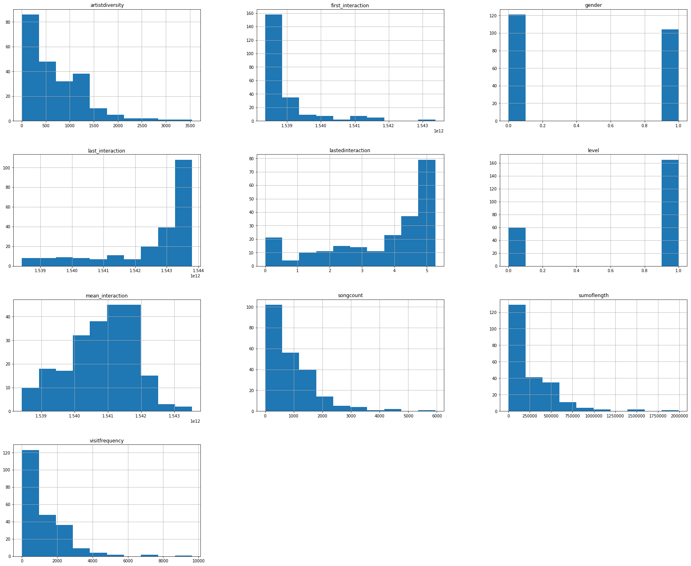

## Summary:

### Difficulties:

+ The deterministic problem I could not solve in time, as I did not 
  manage to asign the 'incoming song usage rates' to regular bins of 
  lifetime of the contract before churning.
+ The spark aws environment does not contain any matplotlib or pandas modules -- at least not for me.
+ Thus I had to restrict and compactify the notebook to pure pyspark.
+ Calculation-Time for one type of Classifier took about 20 min.
    With strongly reduced featureset, RFC reached a f1 metric of 0.66 
    
### Thanks 

...to Stack Overflow and the (fictious?) Sparkifiers for making their data available and to Udacity for the oportunity to handle it.
    